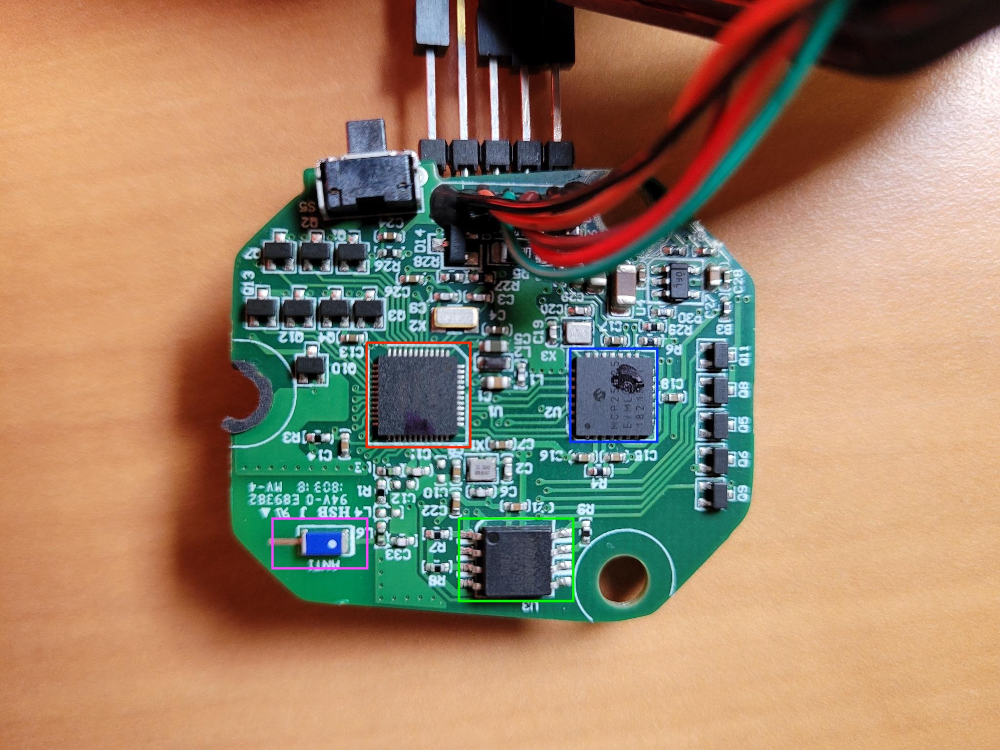
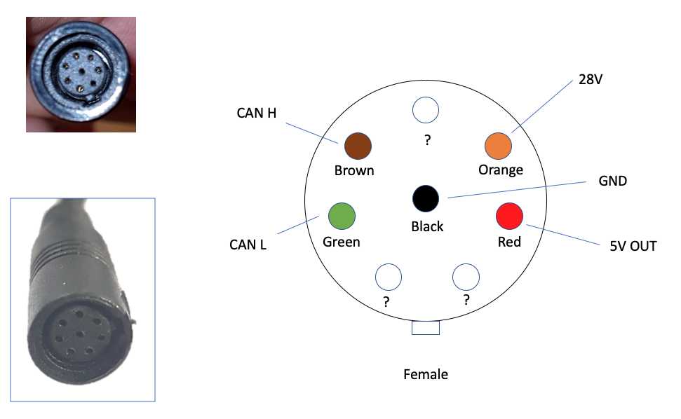
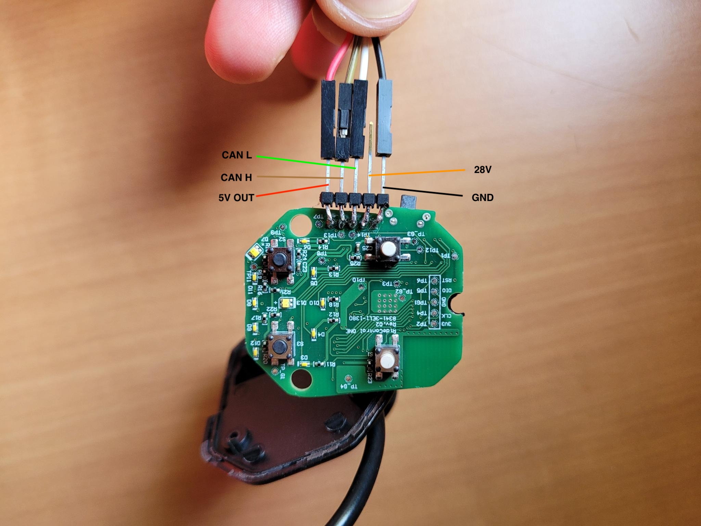
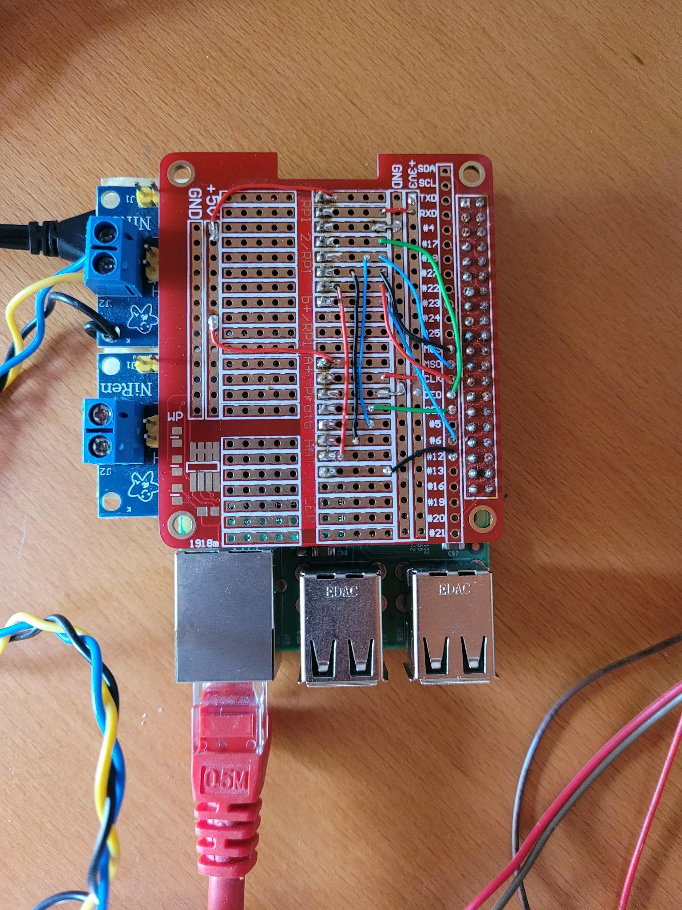
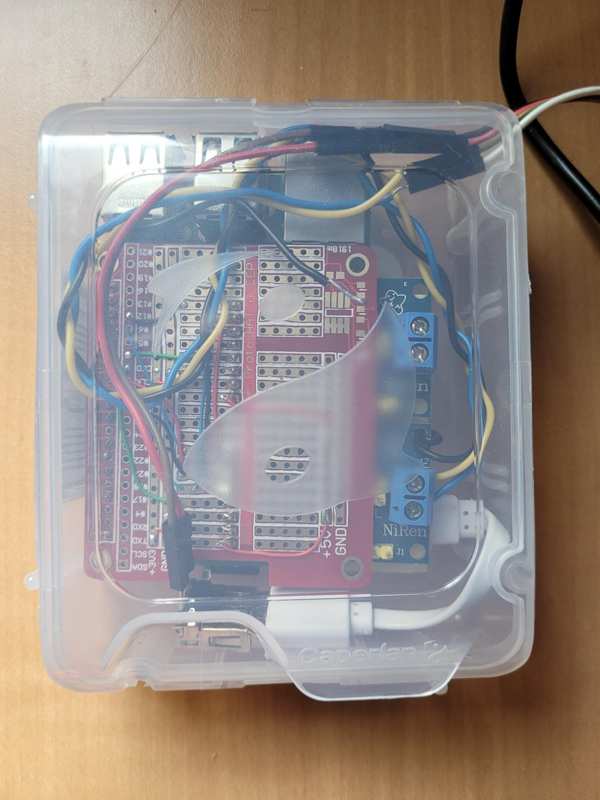
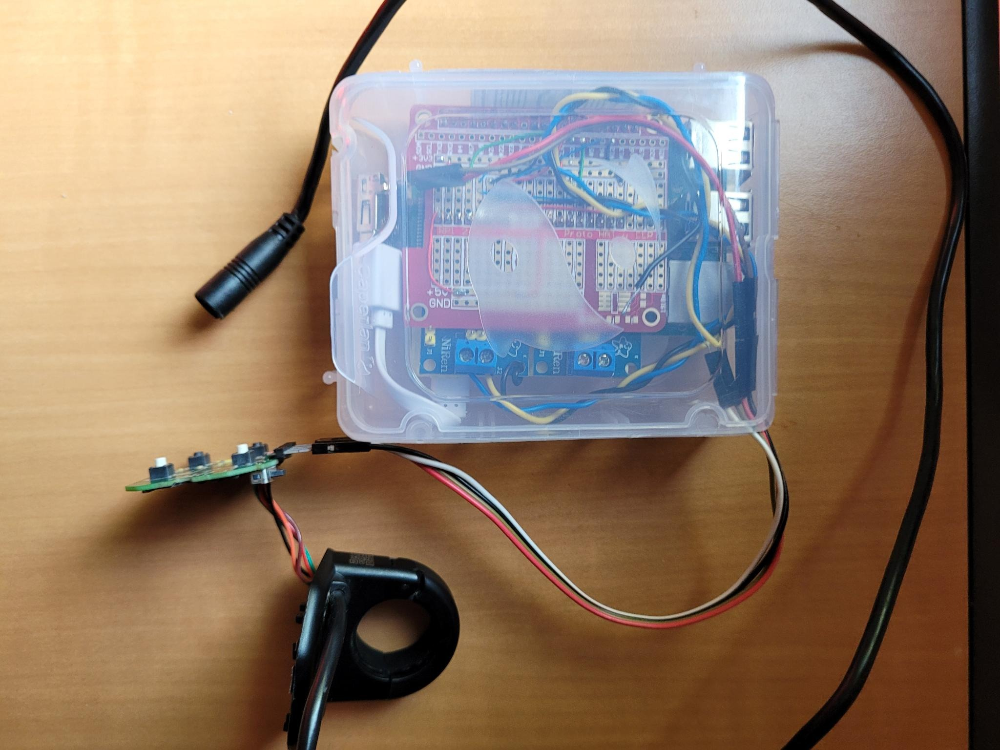
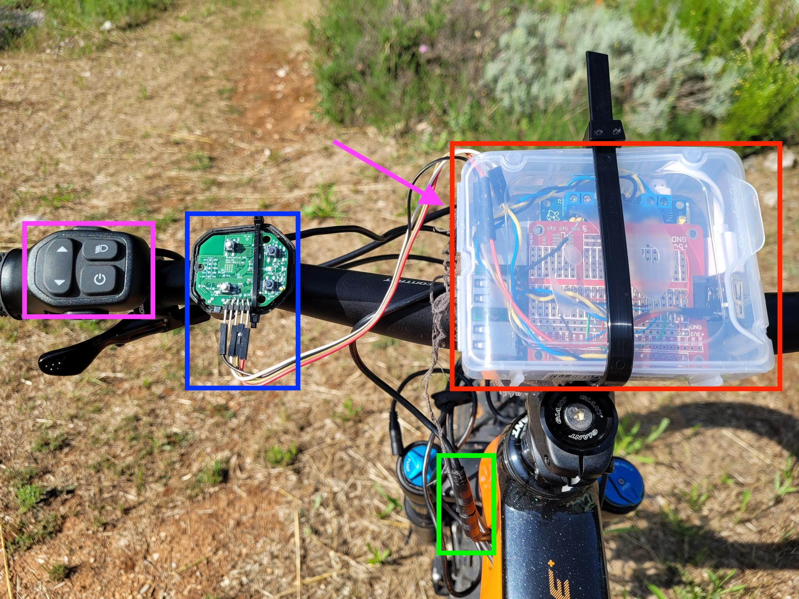
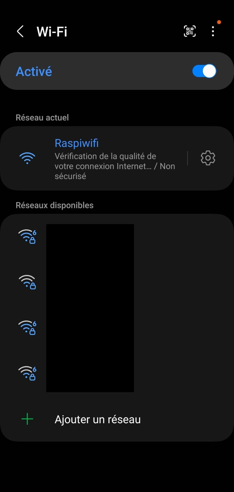
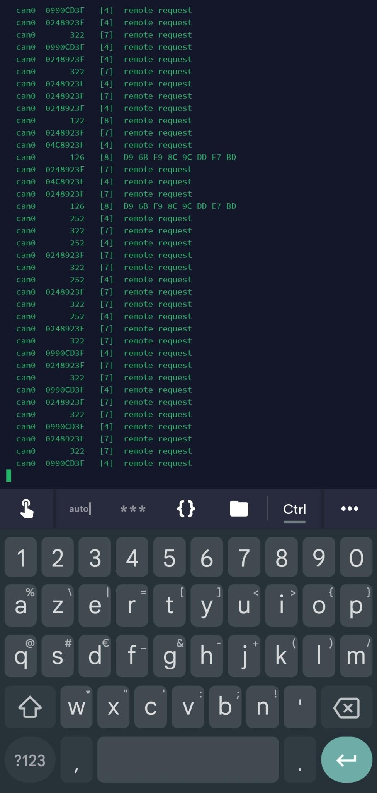
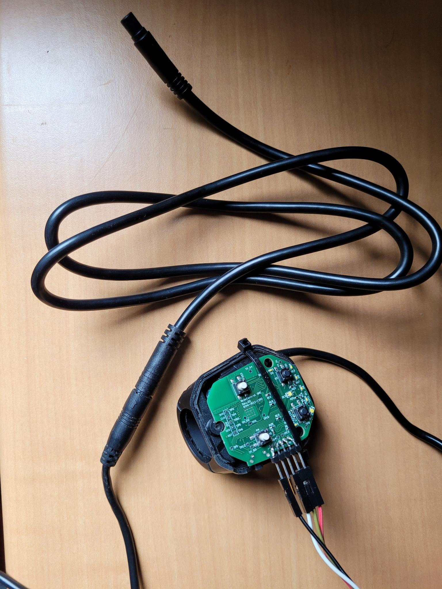

# Giant-CanBus

I recently bought a used Giant Trance E+1 Pro 2019 eBike. That's my first eBike. Great bike BTW ;)
The motor is a Giant Syncdrive pro aka Yamaha PW-X. This motor (and it's battery) communicate with canbus.

I'am newbie on canbus, but this is a good way to play around with it and learn a lot !

My bike came with a [Ridecontrol One](https://www.giant-bicycles.com/us/showcase/ridecontrol-one) (not the Ant+ one). This is fine, but I also bought a used [Ridecontrol Evo](https://www.giant-bicycles.com/us/showcase/ridecontrol-evo) with a large screen.
So I installed the Ridecontrol Evo on the bike and remain with the One unused. And guess what ? I opened it ... of course.

# Ridecontrol One



* Red : Nordic nRF52832, Main microcontroller in charge of main processing and bluetooth.
* Blue : Microchip MCP25625, External CAN Controller with Integrated Transceiver
* Green : Winbond 25Q32JVSIQ, 3V 32M-BIT SERIAL FLASH MEMORY WITH DUAL, QUAD SPI
* Pink : Bluetooth antenna

Be aware that you will distroy the seal when opening it. You'll need a silicon seal to be waterproof again.

The connector pinout is the following :



I soldered a 2.54 connector on top of the board to be ready to snif



REM : Note that the Ridecontrol One output 5V (as the Evo). This is great, as you can power the Raspberry with it ! Seems that the current delivered is enought !

# Raspberry Pi

I took a Raspberry Pi 3 B+ and use two MCP2515 cheap chineese board to get access to CAN Bus.



To configure (only one board):

In /boot/config.txt
```
dtparam=spi=on
dtoverlay=mcp2515-can0,oscillator=16000000,interrupt=6
```
Adapt to your hardware (interrupt pin)

Then :
```
sudo ip link set can0 down && sudo ip link set can0 up type can bitrate 500000 listen-only on
```
I use listen-only for now (safer).

and installed can utils
```
sudo apt-get install can-utils
```

I also setted up the Raspberry as Wifi AP.

# Let's bind all together

I installed the Raspbery in a small box



And with Ridecontrol One connected



The connection is quite simple :
* 5V OUT from the Ridecontrol to Raspberry 5V input on USB micro port
* GND to Raspberry GND on USB micro port
* CAN H to CAN H
* CAN L to CAN L

And attach to the bike



* Blue : Ridecontrol One
* Red : Raspberry Pi with CAN boards
* Green : Ridecontrol One connected to the bike
* Pink : Ridecontrol Evo command (not connected)
* Pink arrow : Ridecontrol Evo display underneath the raspberry (with soft tissue to avoid scratches)

Well tightened !

# Sniffing

I just had to connect my phone to the wifi AP



Check that all was OK



And start recording :

```
nohup canbus can0 -l
```

# Recording

For now, I have only two files :

* One for the poweron/poweroff sequence : [file](./resources/logs/poweron-poweroff.log)
* One for a 15 minutes ride : [file](./resources/logs/ride1.log)

# Cable

To connect to the bike without having to use the solder iron too much ;), I ordered this [cable](https://www.amazon.fr/dp/B096VKQVWT?psc=1&smid=AQ1IBDB6G2RRD&ref_=chk_typ_imgToDp) (quite expensive, but you can find it on [Aliexpress](https://fr.aliexpress.com/item/1005005361586979.html) a lot cheaper but have to wait weeks for delivery !)



# Decoding

My idea is to playback the recorded files to the Ridecontrol Evo and, thanks to the screen, see if I can isolate frames for speed, SoC, SoH ...

Ongoing ...